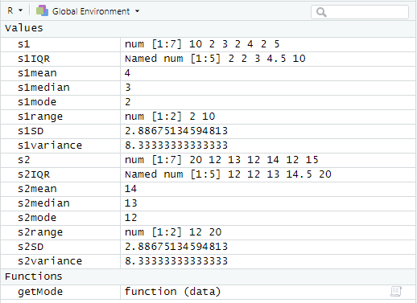

# Justin Stutler
### Sophomore USF Information Science - Data Science and Analytics
### Jstutler@usf.edu

### About me
### Hello all. I am Justin Stutler. I previoiusly studied Computer Science and played esports at Kennesaw State University. I have worked some in web development and enjoyed the challenges, but I am more interested in working in the Data Science field. After the creation of AlphaGo and AlphaZero, how could I not be interested in pursuing data?
### Outside of school, I enjoy yoga, cooking, board games, video games, anime, documentaries, learning, and meeting new people.
&nbsp;
&nbsp;
### First R Studio Assignment LIS 4372
``` 
1 assignment = c(6,18,14,22,27,17,22,20,22)
2 myMean = function(assignment) {
3 return(sum(assignment)/length(assignment))
4 }
5 myMean(assignment)
```
### So, what happens in the code above?
```
1: we created a container "assignment" that holds the data values of 6,18,14,22,27,17,22,20,22
2-4: we created a function "myMean" that returns the mean of a given container
5: we called "myMean" with a parameter of (assignment) which returned 18.66667 as the mean of assignment
```
&nbsp;
&nbsp;
### Module 3 R Studio Assignment LIS 4372
```
s1 = c(10,2,3,2,4,2,5)
s2 = c(20,12,13,12,14,12,15)

# for each set
# compute mean, median, mode under Central Tendency
# mean
s1mean = mean(s1)
s2mean = mean(s2)
# median
s1median = median(s1)
s2median = median(s2)
# create mode function
getMode = function(data) {
  uniqv = unique(data)
  uniqv[which.max(tabulate(match(data, uniqv)))]
}
# mode
s1mode = getMode(s1)
s2mode = getMode(s2)
# compute range, interquartile, variance, standard deviation under Variation
# range
s1range = range(s1)
s2range = range(s2)
# interquartile
s1IQR = quantile(s1)
s2IQR = quantile(s2)
# variance
s1variance = var(s1)
s2variance = var(s2)
# standard deviation under variation
s1SD = sd(s1)
s2SD = sd(s2)
# compare results between s1 and s2 by discussing differences
summary(s1)
summary(s2)
# post result and discussion on your blog
```

### Comparing Datasets s1 and s2 
### The values in the dataset s2 are equivalent to the values of dataset s1 + 10. The interquartile range, mean, median, mode, and range of s2 are equivalent to the values in s1 + 10. The variance of s1 and s2 is the same at 8.3 repeating. The standard deviation of s1 and s2 is the same at ~2.887. The variance and standard deviation of the datasets are the same because the values deviated from the mean the same amount.
